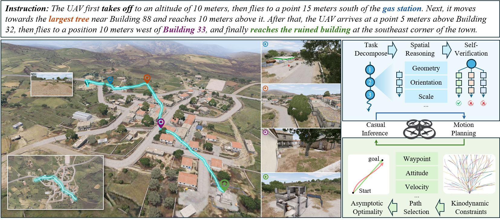
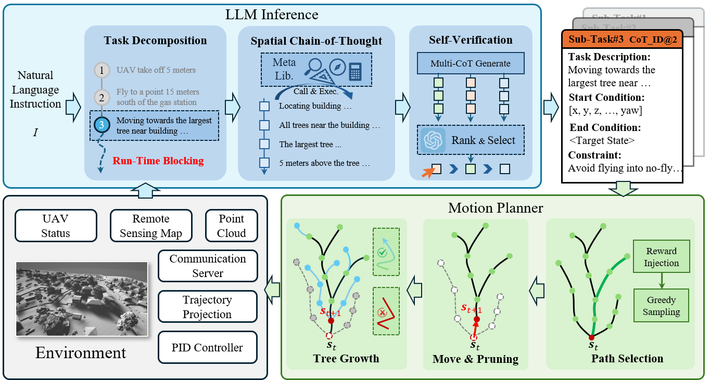
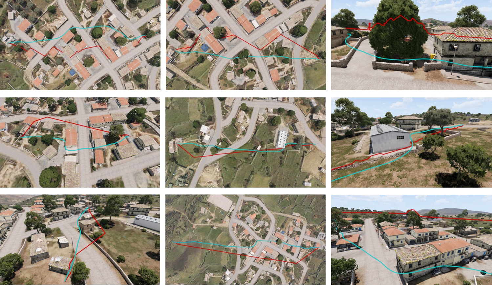

# 📄 Title  
**AeroSeek: Exploring LLM-Enhanced UAV Navigation for Low-Altitude and Dynamic Applications**

## 📌 Abstract  
Though Unmanned Aerial Vehicles (UAVs) hold immense potential for transforming the **Low-Altitude Economy**, developing an agent that combines both **intelligence and flexibility** remains a significant challenge. To this end, we propose a novel aerial navigation system, **AeroSeek**, designed to search executable paths that **coherently transition from cognitive understanding to physical movement**, enabling more **autonomous, flexible navigation** under instruction guidance.

Specifically, given a navigation instruction, we follow a **fast-slow thinking procedure** inspired by drone pilots, breaking down complex decisions into **manageable sub-tasks** and initiating motion planning **immediately** upon completion of each sub-task for real-time movement. By integrating **multi-Chain-of-Thought reasoning**, AeroSeek is capable of **spatial recognition and self-verification**, effectively searching for **robust sub-goals** under expected constraints.

For sub-goal navigation, we introduce **OnKi-RRT**, a novel **kinodynamic-aware motion planner** that ensures both **asymptotic optimality** and **dynamic obstacle avoidance**. Benefiting from the proposed **two-tier searching protocol**, AeroSeek demonstrates advanced capabilities in handling complex instructions while adapting to **dynamic aerial conditions**. Extensive experiments validate the effectiveness of AeroSeek across **tasks of varying complexity**.

## 🛠 Methodology  
- **Hierarchical Search Framework:** Combines high-level reasoning and low-level motion planning.  
- **Language-Guided Navigation:** Uses LLMs to generate and validate intermediate sub-tasks.  
- **Task Verification via CoV:** Ensures robust task selection by verifying intermediate steps.  
- **Kinodynamic RRT-based Motion Planning:** Searches dynamically feasible trajectories under UAV constraints.  

## 📊 Experimental Results  
- **Environment:** ARMA3-based urban simulation.   
- **Metrics:** Success Rate, Precision (P), Recall (R), F1, NoSC (the Number of Self-Corrections), Path Search Time, Path Length. 

## 🎯 Conclusion  
This work introduces a novel LLM-driven hierarchical search framework that enhances UAV navigation in **low-altitude urban environments**. By integrating **language-driven reasoning** with **kinodynamic motion planning**, our approach enables UAVs to **execute high-level instructions effectively and robustly**. Future work will focus on **real-world deployment** and further improvements in **multi-agent coordination**.

